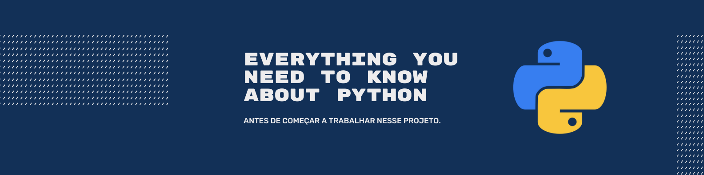

# Step by Step through Python

> Concentramos nesse espaço um resumo de tudo o que você precisa saber sobre  a linguagem de programação Python antes de começar a trabalhar. Não pule esta estapa, ela é imprescindível para que o seu desenvolvimento e avanço no projeto seja mais rápido.


## Read the docs!
> O conteúdo deste passo a passo é resumido. Dúvidas surgirão ao longo do desenvolvimento. Para saná-las, leia a documentação! Ela é completa!
> * Link: https://docs.python.org/3/
---
# Let's go!

<!-- TABLE OF CONTENTS -->
<details open="open">
  <summary>Sumário</summary>
  <ol>
      <a href="#getting-started">Getting Started</a>
      <ul>
        <li><a href="#installation">Installation</a></li>
        <li><a href="#execution">Execution</a></li>
      </ul>
    </li>
    <li><a href="#primeiro-programa">Primeiro programa</a></li>
    <li><a href="#condicionais">Condicionais</a></li>
    <li><a href="#loops">Loops</a></li>
    <li><a href="#funcoes">Funções</a></li>
    <li><a href="#classes">Classes</a></li>
    <li><a href="#bibliotecas">Bibliotecas</a></li>
  </ol>
</details>

<!--**Your name**
* *Initial work* - [repository-name][repository-url] (Repository space)
* *Released on* [cloud-provider][cloud-provider-url] (Cloud provider)
* *My professional profile on* [LinkedIn][linkedin-url]-->
---


# Getting started

Para iniciar, é necessário verificar se o Python está instalado no seu sistema operacional. Você precisa também entender como executar um programa em Python. Separamos estes tópicos em duas sessões apresentadas a seguir.

<!--_For more examples and usage, please refer to the [Wiki][wiki]._-->


## Installation

O Python já	vem	instalado nos sistemas Linux e Mac OS, mas será	necessário
fazer o	download da **versão 3.9**, que é a utilizada no projeto. O Python não vem instalado por padrão no Windows e o download deverá ser feito no site https://www.python.org/downloads/.


**Update da versão 3.9 em Linux:**

*Verificar a versão atual:*

```sh
$ python3 --version
```
*Instalar a versão 3.9 (caso a atual não seja esta):*
```sh
$ sudo apt update -y
$ sudo apt install python3.9
```

## Execution

### Modo Interativo

Para executar um programa em Python, pode-se acessar o Shell do Python, chamado de Python Interativo ou de Python Shell, usando o comando **python** no terminal. Os comandos são executados imediatamente quando se pressiona a tecla enter. Neste caso, não é possível estruturar códigos e procedimentos mais complexos. Ele é melhor utilizado para testes de procedimentos simples e instruções rápidas. Para sair e voltar ao terminal, deve-se usar o comando **exit()**.

```python
$ python
Python 3.9.2 (default, Oct  8 2020, 12:12:24)
[GCC 8.4.0] on linux
Type "help", "copyright", "credits" or "license" for more information.
>>> print("Olá")
Olá
>>> exit()
$
```
### Modo Script

Como citado, o modo Interativo não é capaz de armazenar sequências de comandos ou rotinas para serem executados posteriormente. Para isso, é preciso usar códigos, conhecidos como roteiros ou scripts, no caso do Python, chamado de Python Script.
Esses arquivos contém instruções para serem executadas. É importante afirmar novamente que os scripts são executados de formas sequenciais. Eles podem ser criados até mesmo pelo bloco de notas ou qualquer editor de texto e editados livremente. Para isso, basta salvá-los com a extensão .py.

Para executá-los, basta abrir o terminal, navegar até onde estão salvos os arquivos desejados e usar o comando python arquivo.py:

```python
# Certifique-se de que o arquivo
# esteja no diretorio corrente
$ python meu_programa.py
```

---

# Primeiro programa


É importante conhecer algumas regrinhas antes de iniciar a programar em Python. Esta linguagem foi desenvolvida com o objetivo de ser algo intuitivo, bonito e fácil para os programadores. Esqueça algumas regras de sintaxe que você conhecia antes.

> * Não é necessário o uso do ponto e vírgula (;) ao fim de uma linha de instrução
> * Não utiliza-se as chaves ({}) para iniciar e encerrar um loop, condicional, função, classe, etc.
> * Utiliza-se o símbolo '#' para iniciar um comentário
> * A identação é obrigatória. A falta de identação é identificada como erro de sintaxe no seu programa

## Entrada do usuário

Para se criar rotinas e procedimentos mais sofisticados, por vezes, é necessário programar para coletar dados do usuário e imprimir os resultados. Isto é chamado de entrada e saída de dados. A função canônica de entrada de dados, isto é, para pedir informações do usuário é a função input. Nela, o argumento é uma mensagem impressa e o retorno é o que o usuário digitar.

```python
>>> frase = input('digite uma frase\n')
digite uma frase
Ola
>>> frase
'Ola'
```

Nesta função, mesmo que o usuário digite valores numéricos, os dados serão armazenados como strings. Para usá-los como outros tipos de dados, deve convertê-los.

```python
>>> x = int( input('digite um valor\n') )
digite um valor
2
>>> x
2
```

## Saída do usuário

Para a saída de dados há a função print. Pode imprimir mais de uma string e também valores, separados por vírgulas.

```python
>>> print(1, 'mais', 1, 'igual a', 2)
1 mais 1 igual a 2
>>>
```
Para se imprimir variáveis, há varias formas de fazê-lo.
O exemplo irá supor duas variáveis, sendo elas nome e nota:

```python
>>> nome = 'Joao'
>>> nota = 10
```
Uma das formas é passar a variável como tupla. Neste modo, os locais na string que serão substituídos por variáveis são indicados com % seguidos de uma letra.

```python
>>> print('A nota de %s foi %s' % (nome , nota))
A nota de Joao foi 10
```

Outra maneira é passar como um dicionário. Este modo é parecido com o anterior, a diferença é que são postas etiquetas dentro de parênteses para indicar a variável.

```python
>>> print('A nota de %(n1)s foi %(n2)s' % {’n1’: nome , ’n2’: nota })
A nota de Joao foi 10
```
Uma outra forma muito comum, é utilizar o  **.format**. Neste modo, onde seriam as variáveis deve-se substituir por chaves "{}" e explicitar as variáveis em seguida.

```python
>>> print('A nota de {} foi {}'.format(nome , nota))
A nota de Joao foi 10
```

---

# Condicionais

As estruturas condicionais auxiliam o programador nas tomadas de decisão dentro do código. Para *Python*, as estruturas são: **IF**, o **ELSE** e o **ELIF**.

O **IF**, que traduzindo significa SE, avalia uma condição e, caso a condição seja verdadeira, executa um bloco de ações com identação de 4 espaços. Caso a condição seja falsa, o bloco dentro do IF não é executado. Sua sintaxe é a seguinte:

```python
x = 10

if x > 5:
    print('O número é maior que 5')
```
Como 10 é maior que 5, a expressão é verdadeira e, desta forma, a mensagem do print será exibida na tela. Mas poderíamos executar outro bloco de ações, caso a expressão seja falsa, para isso temos o **ELSE**.

O ELSE é escrito logo abaixo dos comandos do IF, mas sem a identação:

```python
x = 4

if x > 5:
    print('O número é maior que 5')
else:
    print('O número não é maior que 5')
```
Ao avaliar e constatar que a condição é falsa, somente o print do ELSE será mostrado na tela. Também é possível colocar outro IF dentro do ELSE, de modo que, caso a expressão seja falsa, teremos outra condição que deverá ser avaliada e outra sequencia de ações para ser executada.

```python
x = 4

if x > 5:
    print('O número é maior que 5')
else:
    if x > 2:
        print('O número não é maior que 5, mas é maior que 2')
    else:
        print('O número não é maior que 5 e nem maior que 2')
```

Para facilitar a legibilidade, a linguagem Python oferece o comando **ELIF** que substituirá o ELSE IF. Reescrevendo o exemplo anterior, temos:

```python
x = 4

if x > 5:
    print('O número é maior que 5')
elif x > 2:
    print('O número não é maior que 5, mas é maior que 2')
else:
    print('O número não é maior que 5 e nem maior que 2')
```
---

# Loops

1. Fork it (<https://github.com/yourname/yourproject/fork>)
2. Create your feature branch (`git checkout -b feature/fooBar`)
3. Commit your changes (`git commit -am 'Add some fooBar'`)
4. Push to the branch (`git push origin feature/fooBar`)
5. Create a new Pull Request

---

# Funções

Um dos conceitos mais importantes em programação é o de função. As funções tornam possível decompor um programa complexo em uma série de sub-rotinas mais simples, que por sua vez podem ser divididas em fragmentos menores, e assim por diante. Por outro lado, as funções são reutilizáveis: se tivermos uma função capaz de calcular uma raiz quadrada, por exemplo, podemos usá-la em todos os lugares em nossos programas sem precisar reescrevê-la todas as vezes.


## A função print()

Já conhecemos essa função, mas cabe especificar que a função print() pode exibir qualquer número de valores fornecidos como argumentos (isto é, entre parênteses). Por padrão, esses valores serão apresentados separados uns dos outros por um espaço e por fim será adicionada uma quebra de linha. Você pode substituir o separador padrão (espaço) por qualquer outro caractere (ou mesmo qualquer caractere) com o argumento sep. Exemplo:

```python
>>> print("Bom", "dia", "a", "todos", sep ="*")
Bom*dia*a*todos
>>> print("Bom", "dia", "a", "todos", sep ="")
Bomdiaatodos
```

Da mesma forma, você pode substituir a quebra de linha pelo argumento final:

```python
>>> n =0
>>> while n<6:
...     print("zut", end ="")
...     n = n+1
...
zutzutzutzutzut
```

## Importar um módulo de funções

Você já encontrou algumas funções embutidas no próprio Python, como a função `len()`, que retorna o tamanho de uma string ou de uma lista. As funções integradas na linguagem são relativamente poucas: são apenas aquelas que provavelmente serão usadas com muita frequência. Os outros são agrupados em arquivos separados chamados módulos.

Veremos como é fácil dividir um programa mais complicado em vários arquivos pequenos para facilitar a manutenção. Um aplicativo típico do Python consistirá, então, em um programa principal, acompanhado por um ou mais módulos, cada um contendo as definições de várias funções complementares. Há um grande número de módulos pré-programados que são automaticamente fornecidos com o Python. Muitas vezes são agrupados em um único módulo conjuntos de funções relacionadas, que chamamos de bibliotecas. O módulo de matemática, por exemplo, contém definições de muitas funções matemáticas, como seno, cosseno, tangente, raiz quadrada e assim por diante. Para poder usar essas funções, basta incorporar a seguinte linha no início do script:

```python
from math import *
```

Esta linha diz ao Python que ele deve incluir no programa atual todas as funções (este é o significado do asterisco) do módulo de matemática, que contém uma biblioteca de funções matemáticas pré-programadas.

No corpo do próprio script, você escreverá por exemplo: raiz = sqrt(numero) para atribuir à variável raiz a raiz quadrada do número, seno_x = sin(angulo) para atribuir à variável seno_x o seno do ângulo (em radianos!), etc.

Exemplo:

```python
# Demo: usando as funções do módulo <math>

from math import *

numero = 121
angulo = pi/6        # é 30°
                    # (a biblioteca de matemática também inclui a definição de pi)
print("raiz quadrada de", numero, "=", sqrt(numero))
print("seno de", angulo, "radianos", "=", sin (angulo))
```

Executar este script faz com que a exibição a seguir:

```
raiz quadrada de 121 = 11.0
seno de 0.5235987755982988 radianos = 0.49999999999999994
```

## Definindo funções

A programação é a arte de ensinar ao computador como executar tarefas que ele não era capaz de fazer. Um dos métodos mais interessantes para isso é adicionar novas instruções na forma de funções originais.

A abordagem eficaz para um problema complexo, tipicamente, consiste de dividi-lo em subproblemas mais simples, que serão estudados separadamente. Por outro lado, muitas vezes a mesma sequência de instruções deve ser usada várias vezes em um programa, e obviamente não será necessária reproduzi-la repetidamente.

A sintaxe do Python para definir uma função é a seguinte:

```python
def nomedafuncao(argumento1, argumento2, ...):
     bloco de código
```

* Você pode escolher qualquer nome para a função que está criando, com exceção das palavras reservadas pela língua e desde que você não use nenhum caractere especial ou acentuado (o caractere underline `_` é permitido). Como é o caso dos nomes de variáveis, aconselha-se a usar principalmente letras minúsculas, especialmente no início do nome.
* Como as declarações `if` e `while` que você já conhece, a instrução `def` é uma instrução composta. A linha que contém esta instrução termina necessariamente com dois pontos, que introduz um bloco de código que você não deve esquecer de indentar.
* A lista de parâmetros especifica quais informações fornecer como argumentos quando você quiser usar esta função (parênteses podem permanecer vazios se a função não requer argumentos).
* Uma função é usada quase como qualquer instrução. No corpo de um programa, chamar uma função consiste do nome da função seguido de parênteses. Se necessário, deve-se colocar o argumento ou argumentos que queremos transmitir para a função dentro dos parênteses.

### Função Simples sem parâmetros

```python
>>> def tabuada7():
...     n = 1
...     while n <11 :
...         print(n * 7, end =' ')
...         n = n +1
...
```

Depois de definir a função acima, podemos executá-la:

```python
>>> tabuada7()
```

E observaremos

```python
7 14 21 28 35 42 49 56 63 70
```

Agora podemos reutilizar esse recurso várias vezes, quantas vezes desejarmos. Podemos também incorporá-lo na definição de outra função, como no exemplo abaixo:

```python
>>> def tabuada7tripla():
...     print('A tuabuada do 7 triplicada:')
...     tabuada7()
...     tabuada7()
...     tabuada7()
...
```

Quando executada

```python
>>> tabuada7tripla()
A tuabuada do 7 triplicada:
7 14 21 28 35 42 49 56 63 70
7 14 21 28 35 42 49 56 63 70
7 14 21 28 35 42 49 56 63 70
```

### Função com parâmetros

Não seria mais interessante definir uma função que possa exibir qualquer tabuada, sob demanda?

Na definição de tal função, é necessário fornecer uma variável específica para receber o argumento transmitido. Essa variável específica é chamada de parâmetro. Esse parâmetro recebe um nome com as mesmas regras de sintaxe das variáveis (sem letras acentuadas, etc.) e esse nome é colocado entre os parênteses que acompanham a definição da função. Aqui está o que nos interessa:

```python
>>> def tabuada(base):
...    n = 1
...    while n <11 :
...       print(n * base, end =' ')
...
```

Experimente:

```python
>>> tabuada(13)
13 26 39 52 65 78 91 104 117 130
```

```python
>>> tabuada(9)
9 18 27 36 45 54 63 72 81 90
```

Utilizando uma variável como um argumento

O argumento que usamos ao chamar uma função também pode ser uma variável, como no exemplo abaixo. Dê uma boa olhada e execute este exemplo. Este exemplo apresenta um caso da utilidade das funções simples para realizar tarefas complexas.

```python
>>> a = 1
... while a <20:
...    tabuada(a)
...    print("")
...    a = a + 1
...
```

> Nota importante

No exemplo acima, o argumento que passamos para a função tabuada() é o conteúdo da variável a. Dentro da função, esse argumento é atribuído ao parâmetro base, que é uma variável totalmente diferente. Então observe agora que:

> O nome de uma variável que passamos como argumento de uma função não tem relação com o nome do parâmetro correspondente na função.

Esses nomes podem ser idênticos, mas é importante entender que eles não designam a mesma coisa (apesar do fato de que eles podem conter o mesmo valor).

### Funções com vários parâmetros

A função `tabuada()` é certamente interessante, mas sempre exibe apenas os dez primeiros termos da tabela de multiplicação, ao passo que podemos desejar que ela exiba outros. Não importa. Vamos aprimorá-lo adicionando parâmetros adicionais, em uma nova versão que chamaremos a essa tabela de `tabuadaMulti()`:

```python
>>> def tabuadaMulti(base, inicio, fim):
...    print('Parte da tabuada da base', base, ':')
...    n = inicio
...    while n <= fim :
...       print(n, 'x', base, '=', n * base)
...       n = n +1
```

Esta nova função, portanto, usa três parâmetros: a base da tabela como no exemplo anterior, o índice do primeiro termo a ser exibido, o índice do último termo a ser exibido. Experimente.

### Variáveis ​​locais, variáveis ​​globais

Quando definimos variáveis ​​dentro do corpo de uma função, essas variáveis ​​são acessíveis apenas à própria função. Essas variáveis ​​são consideradas variáveis ​​locais para a função. Isto é, por exemplo, o caso das variáveis `​​base`, `inicio`, `fim` e `n` no exercício anterior. Se tentarmos exibir o conteúdo da variável base logo após realizar o exercício acima, receberemos uma mensagem de erro:

```python
>>> print(base)
Traceback (most recent call last):
  File "<stdin>", line 1, in <module>
NameError: name 'base' is not defined
```

A máquina nos diz claramente que o símbolo base é desconhecido. Variáveis ​​definidas fora de uma função são variáveis ​​globais. Seu conteúdo é “visível” de dentro de uma função, mas a função não pode mudá-la. exemplo:

```python
>>> def mask():
...     p = 20
...     print(p, q)
...
>>> p, q = 15, 38
>>> mask()
20 38
>>> print(p, q)
15 38
```

### Funções e procedimentos

Para os puristas, as funções que descrevemos até agora não são exatamente funções no sentido estrito, mas sim procedimentos. Uma função “verdadeira” (no sentido exato) deve, de fato, retornar um valor quando termina. É isso que acontece quando utilizamos` y = sin(a)`, por exemplo. É fácil entender que nesta expressão, a função `sin()` retorna um valor (o seno do argumento `a`) que é então atribuído à variável `y`.

Vamos começar com um exemplo simples:

```python
>>> def cubo(w):
...    return w*w*w
...
```

A instrução `return` define o valor devolvido pela função. Neste caso será o argumento que foi passado para a função elevado ao cubo. Exemplo:

```python
>>> b = cubo(9)
>>> print(b)
729
```

Após aprender estes tópicos sobre funções, você será capaz de modularizar seu código, trazendo legibilidade e facilidade para dar manutenção do mesmo.

Segue uma dica sobre o uso de funções/módulos:

> * É mais fácil testar os módulos individualmente do que o programa completo.

# Classes

Como você já deve saber, classe é definida como um agrupamento de valores e de operações.
Frequentemente classes diferentes possuem características comuns. As classes diferentes podem compartilhar valores comuns e podem executar as mesmas operações. Em Python tais relacionamentos são expressados usando derivação e herança.

Por exemplo, se existir uma classe definida por um usuário MinhaClasseCaderno, então um objeto Caderno1 pode ser criado da seguinte forma:

```python
>>> Caderno1 = MinhaClasseCaderno()
```
## Objetos, atributos e métodos

Uma classe possui instância de atributos, instância de métodos e classes aninhadas. Ou seja, um objeto irá possuir dentro dele alguns valores (atributos), algumas funções (métodos) e algumas classes (aninhadas).

A definição de uma classe é por meio da palavra reservada *class*, uma classe vazia pode ser definida como:

```python
>>> class Vazia():
  pass
>>> X = Vazia()
```
Os atributos são os valores que existem dentro do objeto. Por exemplo: uma classe Caderno será criada, definindo dois atributos, cor e np (número de páginas):

```python
>>> class Caderno():
  cor = 'preto'
  np = 10
>>> NovoCaderno = Caderno ()
>>> NovoCaderno.cor
'preto'
```

```python
>>> NovoCaderno.cor = "roxo"
>>> NovoCaderno.cor
'roxo'
```
Os métodos são funções intrínsecas aos objetos, que podem ser chamados de forma similar aos atributos e definidos como se fossem funções. Continuando com o exemplo da classe Caderno:

```python
>>> class Caderno():
  cor = 'preto'
  np = 10
  def Descreva_se(self):
    print('Este objeto é um caderno, que contém cor e número de páginas')

>>> NovoCaderno = Caderno()
>>> NovoCaderno.Descreva_se()
Este objeto é um caderno, que contém cor e número de páginas
```
Todo método recebe como primeiro parâmetro o próprio objeto, e este parâmetro deve ser declarado explicitamente na definição do método, ele servirá para poder acessar os próprios métodos e atributos.
> É importante ressaltar que self não é uma palavra reservada em Python, mas é amplamente usado por convenção e boas práticas de programação.

### Métodos construtores, acessores e modificadores 


São chamados de métodos acessores os métodos que acessam um atributo do objeto, mas não a modifiquem. Enquanto que os métodos modificadores acessam e modificam. Esses métodos também são chamados de getters e setters, respectivamente. O método construtor é um método especial das classes. Ele é executado sempre que uma nova classe é iniciada e é denotado por __init__. Continuando com o exemplo:

```python
>>> class Caderno():
  cor = 'preto'
  np = 10

  def __init__(self):
    print('Caderno iniciado')

  def getCor(self):
    return self.cor

  def getNp(self):
    return self.np

  def setCor(self, novaCor):
    self.cor = novaCor

  def setNp(self, novoNp):
    self.np = novoNp

>>> C = Caderno()
Caderno iniciado
```

> O conteúdo de Python para Programação Orientada a Objetos é imenso. Recomendamos que você se aprofunde neste assunto buscando outras fontes. Uma sugestão é a playlist gratuita de [POO em Python com o Otávio Miranda](https://www.youtube.com/watch?v=RLVbB91A5-8&list=PLbIBj8vQhvm34qAAEEH_PdL2tMG9rz-P7).

---


# Bibliotecas

