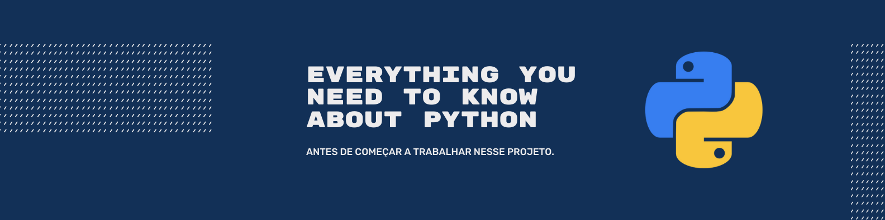

# Step by Step through Python

> Concentramos nesse espaço um resumo de tudo o que você precisa saber sobre  a linguagem de programação Python antes de começar a trabalhar. Não pule esta estapa, ela é imprescindível para que o seu desenvolvimento e avanço no projeto seja mais rápido.


[![Read the docs][docs-image]][docs-url]
> O conteúdo deste passo a passo é resumido. Dúvidas surgirão ao longo do desenvolvimento. Para saná-las, leia a documentação! Ela é completa!
> * Link: https://docs.python.org/3/
---
## Let's go!

<!-- TABLE OF CONTENTS -->
<details open="open">
  <summary>Sumário</summary>
  <ol>
      <a href="#getting-started">Getting Started</a>
      <ul>
        <li><a href="#installation">Installation</a></li>
        <li><a href="#execution">Execution</a></li>
      </ul>
    </li>
    <li><a href="#usage">Usage</a></li>
    <li><a href="#roadmap">Roadmap</a></li>
    <li><a href="#contributing">Contributing</a></li>
    <li><a href="#license">License</a></li>
    <li><a href="#contact">Contact</a></li>
    <li><a href="#acknowledgements">Acknowledgements</a></li>
  </ol>
</details>

<!--**Your name** 
* *Initial work* - [repository-name][repository-url] (Repository space)
* *Released on* [cloud-provider][cloud-provider-url] (Cloud provider)
* *My professional profile on* [LinkedIn][linkedin-url]-->
---


# Getting started

Para iniciar, é necessário verificar se o Python está instalado no seu sistema operacional. Você precisa também entender como executar um programa em Python. Separamos estes tópicos em duas sessões apresentadas a seguir.

<!--_For more examples and usage, please refer to the [Wiki][wiki]._-->


## Installation

O Python já	vem	instalado nos sistemas Linux e Mac OS, mas será	necessário
fazer o	download da **versão 3.9**, que é a utilizada no projeto. O Python não vem instalado por padrão no Windows e o download deverá ser feito no site https://www.python.org/downloads/.


**Update da versão 3.9 em Linux:**

*Verificar a versão atual:*

```sh
$ python3 --version
```
*Instalar a versão 3.9 (caso a atual não seja esta):*
```sh
$ sudo apt update -y
$ sudo apt install python3.9
```

---

## Development setup

Describe how to install all development dependencies and consider do this for multiple platforms.  

```sh
make install
npm test
```

## Running the tests

Remember this is a showcase, thus your potential employer might want to see an automated test-suite of some kind up running.

---

## Built With

* [Maven](https://maven.apache.org/) - Dependency Management
* [Heroku CLI](https://devcenter.heroku.com/articles/heroku-cli#download-and-install) - To deploy on Heroku

## Release History

* 0.2.1
    * CHANGE: Update docs (module code remains unchanged)
* 0.2.0
    * CHANGE: Refactoring - Remove `setAnyMethod()`
    * ADD: Add `newSomething()`
* 0.1.1
    * FIX: Crash when calling `defaultXYZ()` (Thanks @ContributorName)
* 0.1.0
    * The first proper release
* 0.0.1
    * Initial work

---

## Contributing

1. Fork it (<https://github.com/yourname/yourproject/fork>)
2. Create your feature branch (`git checkout -b feature/fooBar`)
3. Commit your changes (`git commit -am 'Add some fooBar'`)
4. Push to the branch (`git push origin feature/fooBar`)
5. Create a new Pull Request

<!-- Markdown link & img dfn's -->

[header-url]: HEADER.png
[header-link]: https://github.com/alexandrerosseto

[repository-url]: https://github.com/alexandrerosseto/wbshopping

[cloud-provider-url]: https://wbshopping.herokuapp.com

[linkedin-url]: https://www.linkedin.com/in/alexandrerosseto

[wiki]: https://github.com/yourname/yourproject/wiki

[docs-image]: https://img.shields.io/badge/IMPORTANT-READ%20THE%20DOCS!-blue
[docs-url]: https://docs.python.org/3/
[Frontend-image]: https://img.shields.io/badge/Frontend-Ionic-blue?style=for-the-badge
[Frontend-url]: https://img.shields.io/badge/Frontend-Ionic-blue?style=for-the-badge
[Backend-image]: https://img.shields.io/badge/Backend-Java%208-important?style=for-the-badge
[Backend-url]: https://img.shields.io/badge/Backend-Java%208-important?style=for-the-badge
